# StockPioneers Application

## Introduction

Welcome to StockPioneers your favorite Stock Exchange Manager Desktop Application! In this endeavor, you will design and implement a comprehensive Stock Exchange Manager using Java, with a strong emphasis on applying the principles of Object-Oriented Programming (OOP). We used JavaFX GUI to implement the User interface for the application. This system will serve as a simulated stock exchange platform, where traders can buy and sell stocks, manage their portfolios, and analyze market data.


This project will provide a robust learning experience in Java programming and OOP principles, offering a realistic simulation of stock exchange operations. We look forward to your innovative solutions and collaborative efforts in bringing this Stock Exchange Manager to life.

## Technology Used

StockPioneers uses JavaFX for its Graphical User Interface (GUI). JavaFX provides a rich set of graphics and media packages to create modern, visually appealing user interfaces. This enhances the user experience by making the application more interactive and user-friendly.


## Installation 

Clone our repository and import the JavaFX library.

The workspace contains folders as shown:

- `src`: the folder to maintain sources
- `lib`: the folder to maintain dependencies.
- `csv files`: the folder that contains data
- `data`: the folder that contains images 

> Don't forget to write the JavaFX library path here, just open `.vscode/launch.json`.

## Login UI
<table style="width:100%;">
  <tr>
    <td style="text-align:center;">
      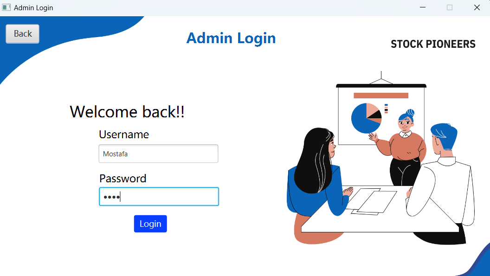
    </td>
    <td style="text-align:center;">
      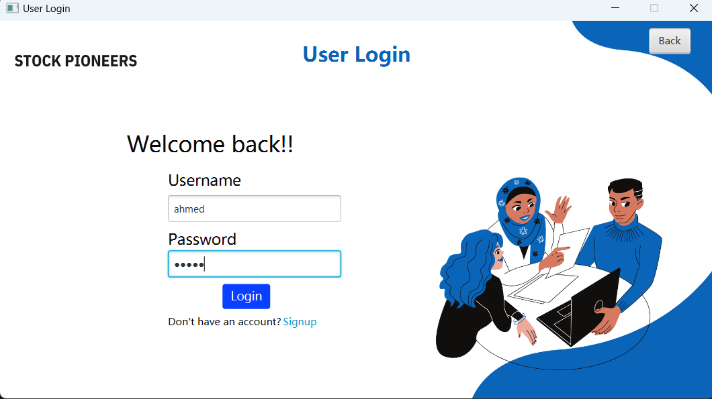
    </td>
  </tr>
</table>

## Key Admin Features and Methods

The `Admin` class in the Stock Exchange Manager is designed to handle critical administrative tasks, ensuring smooth operation and management of the stock exchange platform. Below are some of the most important methods provided for the admin:

### 1. User Management

#### Create User
```java
public void createUser(User user) {
    if (user != null) {
        if (!Users.contains(user)) {
            Users.add(user);
            System.out.println("User created successfully");
        } else {
            System.out.println("This User (" + user.getUserName() + ") already exists");
        }
    } else {
        System.out.println("Invalid user provided");
    }
}
```
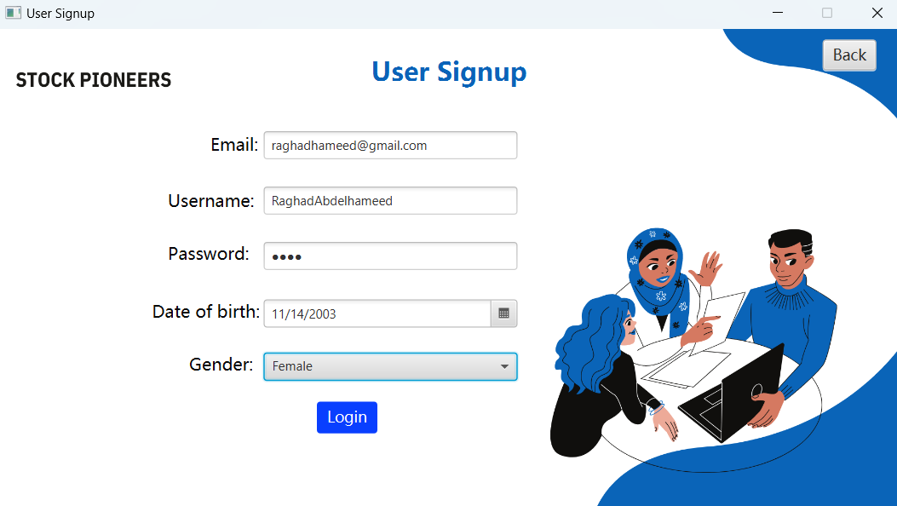
#### Delete User
```java
public void deleteUser(User user) {
    if (user != null) {
        if (Users.contains(user)) {
            Users.remove(user);
            System.out.println("User deleted successfully");
        } else {
            System.out.println("This User (" + user.getUserName() + ") does not exist");
        }
    } else {
        System.out.println("Invalid user provided");
    }
}
```

#### Update User
```java
public void updateUser(User updatedUser) {
    boolean userFound = false;
    for (User user : Users) {
        if (user.getID() == updatedUser.getID()) {
            user.setUserName(updatedUser.getUserName());
            user.setAccountBalance(updatedUser.getAccountBalance());
            System.out.println("User updated successfully");
            userFound = true;
            break;
        }
    }
    if (!userFound) {
        System.out.println("User with ID (" + updatedUser.getID() + ") not found for update");
    }
}
```

#### Access User
```java
public User accessUser(int ID) {
    for (User user : Users) {
        if (user.getID() == ID) {
            return user;
        }
    }
    return null;
}
```
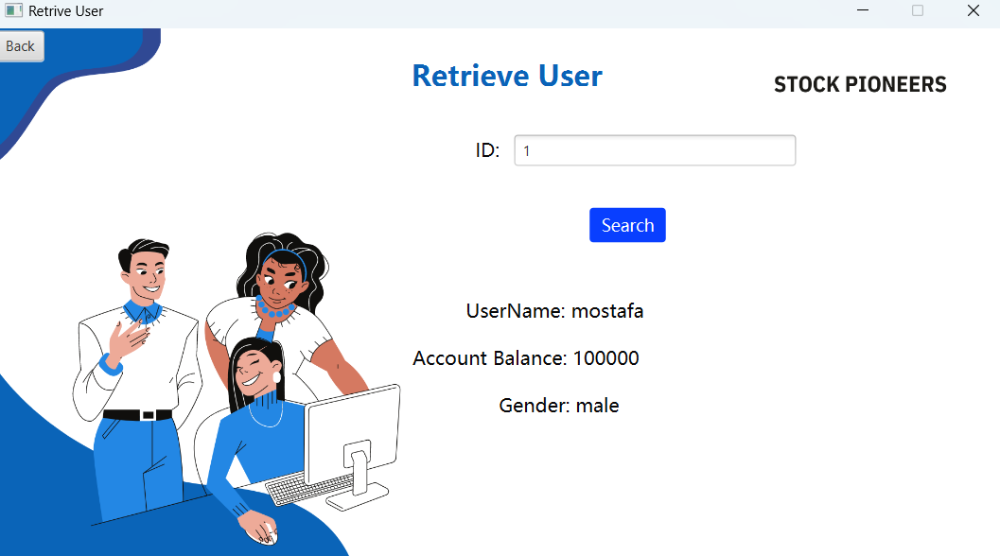

### 2. Stock Management

#### Create Stock
```java
public void createStock(Stock stock) {
    if (stock != null) {
        if (!Stocks.contains(stock)) {
            Stocks.add(stock);
            System.out.println("Stock created successfully");
        } else {
            System.out.println("Stock already exists");
        }
    } else {
        System.out.println("Invalid stock provided");
    }
}
```

#### Delete Stock
```java
public void deleteStock(Stock stock) {
    if (stock != null) {
        if (Stocks.contains(stock)) {
            Stocks.remove(stock);
            System.out.println("Stock deleted successfully");
        } else {
            System.out.println("This Stock (" + stock.getLabel() + ") does not exist");
        }
    } else {
        System.out.println("Invalid stock provided");
    }
}
```

#### Update Stock
```java
public void updateStock(Stock stock, double initialPrice, double openingPrice, double finalPrice,
                        double closingPrice, double tradingPrice, double dividends,
                        double profitPercentage) {
    LocalDateTime dateTime = LocalDateTime.now();
    boolean stockFound = false;
    for (Stock s : Stocks) {
        if (s.getLabel().equals(stock.getLabel())) {
            s.updateStockPrice(initialPrice, openingPrice, finalPrice, closingPrice, tradingPrice, dividends, profitPercentage, dateTime);
            stockFound = true;
            System.out.println("Stock updated successfully.");
            break;
        }
    }
    if (!stockFound) {
        System.out.println("Stock not found.");
    }
}
```

#### Access Stock
```java
public Stock accessStock(String label) {
    for (Stock stock : Stocks) {
        if (stock.getLabel().equals(label)) {
            return stock;
        }
    }
    System.out.println("Stock Not Found");
    return null;
}
```
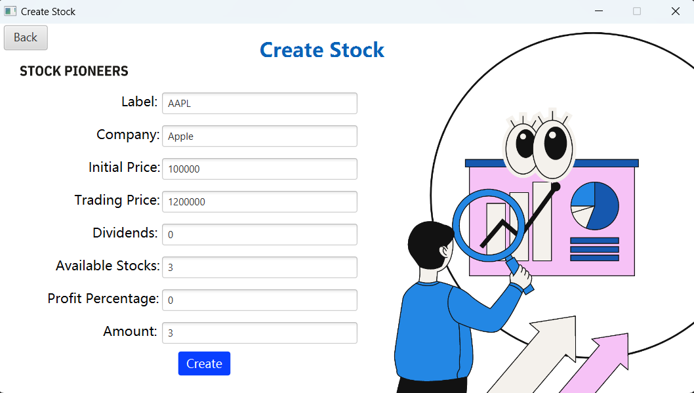

### 3. Stock Price Management

#### Add Stock Price
```java
public void addStockPrice(String label, StockPrice price) {
    if (!getPrices().containsKey(label)) {
        getPrices().put(label, new ArrayList<>());
    }
    getPrices().get(label).add(price);
}
```

#### Display Price History
```java
public void displayPriceHistory(Stock stock) {
    if (Stocks.contains(stock)) {
        List<StockPrice> priceHistory = stock.getPriceHistory();
        if (!priceHistory.isEmpty()) {
            System.out.println("Price history for stock with label: " + stock.getLabel());
            for (StockPrice price : priceHistory) {
                System.out.println(price);
            }
        } else {
            System.out.println("No price history found for stock with label: " + stock.getLabel());
        }
    }
}
```

### 4. Approval System

#### Approve Deposit
```java
public void approveDeposit(RegularUser user, double amount, Transaction transaction) {
    if (tradingmanager.isTradingSessionOpen()) {
        double newAccountBalance = user.getAccountBalance() + amount;
        user.setAccountBalance(newAccountBalance);
        user.markDepositApproval();
        user.removePendingTransaction(transaction);
        user.addFinancialTransactions().add(transaction);
        System.out.println("Deposit request approved for " + user.getUserName());
        System.out.println(user.getUserName() + "'s Updated balance = " + user.getAccountBalance());
    } else {
        System.out.println("Cannot approve deposit request during a trading session");
    }
}
```

#### Approve Withdrawal
```java
public void approveWithdrawal(RegularUser user, double amount, Transaction transaction) {
    if (tradingmanager.isTradingSessionOpen()) {
        double newAccountBalance = user.getAccountBalance() - amount;
        user.setAccountBalance(newAccountBalance);
        user.markWithdrawalApproval();
        user.removePendingTransaction(transaction);
        user.addFinancialTransactions().add(transaction);
        System.out.println("Withdrawal request approved for " + user.getUserName());
        System.out.println(user.getUserName() + "'s Updated balance = " + user.getAccountBalance());
    } else {
        System.out.println("Cannot approve withdrawal request during a trading session");
    }
}
```

### 5. Trading Session Management

#### Initiate Trading Session
```java
public void initiateTradingSession() {
    tradingmanager.openTradingSession();
}
```

#### Close Trading Session
```java
public void closeTradingSession() {
    tradingmanager.closeTradingSession();
}
```

#### Check if Trading Session is Open
```java
public boolean isTradingSessionOpen() {
    return tradingmanager.isTradingSessionOpen();
}
```
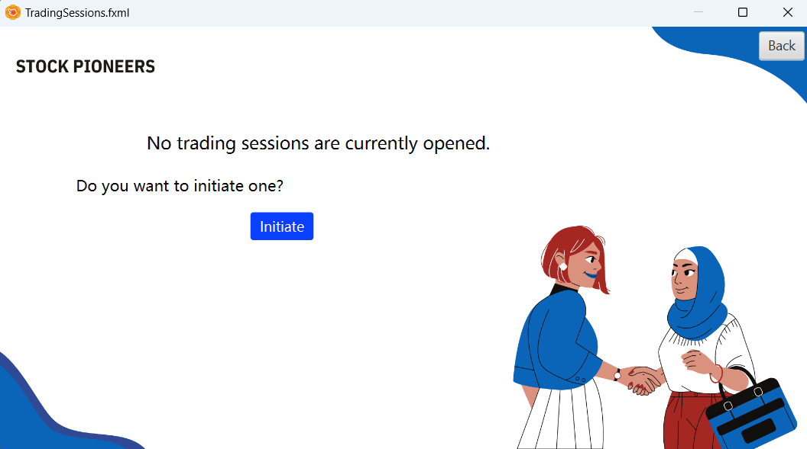

``These methods enable the admin to manage users, stocks, stock prices, and trading sessions efficiently, ensuring a robust and reliable stock exchange system.``

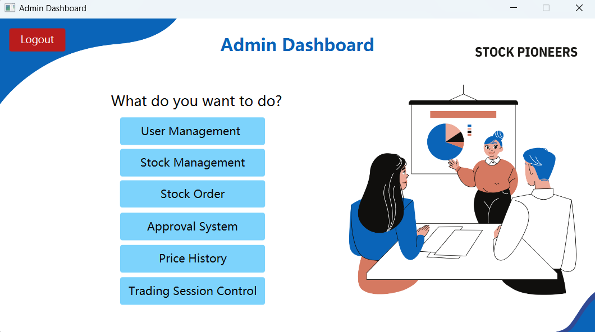

## Key RegularUser Features and Methods

The `RegularUser` class extends from the `User` class, adding functionalities specific to regular users of the stock exchange platform. Here are the essential features and methods for the `RegularUser` class:

### 1. Financial Transactions

#### Deposit Funds (Pending Admin Approval)
```java
public void deposit(double amount) {
    if (amount > 0) {
        Transaction depositTransaction = new Transaction(Operation.deposit, amount);
        pendingTransactions.add(depositTransaction);
        System.out.println("Deposit request submitted for approval.");
    } else {
        System.out.println("Invalid deposit amount.");
    }
}
```

#### Withdraw Funds (Pending Admin Approval)
```java
public void withdrawal(double amount) {
    if (amount > 0 && amount <= getAccountBalance()) {
        Transaction withdrawalTransaction = new Transaction(Operation.withdrawal, amount);
        pendingTransactions.add(withdrawalTransaction);
        System.out.println("Withdrawal request submitted for approval.");
    } else {
        System.out.println("Invalid withdrawal amount or insufficient funds.");
    }
}
```

#### Get Pending Transactions
```java
public List<Transaction> getPendingTransactions() {
    return pendingTransactions;
}
```

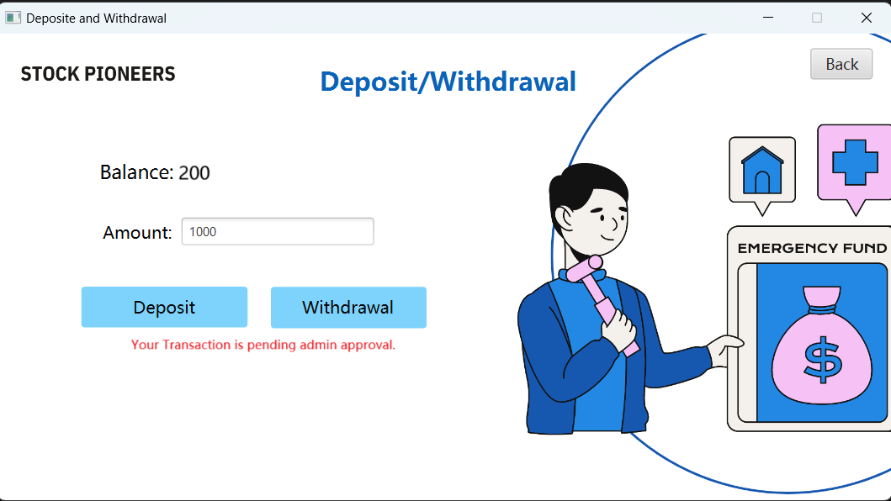


### 2. Stock Orders

#### Buy Stock Order
```java
public void buyStockOrder(String label, String company, double maxPrice, int amount) {
    if (label == null || label.isEmpty() || company == null || company.isEmpty() || maxPrice <= 0 || amount <= 0) {
        System.out.println("Invalid data.");
        return;
    }}
```

#### Sell Stock Order
```java
public void sellStockOrder(String label, String company, double minPrice, int amount) {
    if (label == null || label.isEmpty() || company == null || company.isEmpty() || minPrice <= 0 || amount <= 0 || amount > getStocksinPortfolio()) {
        System.out.println("Invalid data.");
        return;
    }
}
```

### 3. Transaction History

#### List All Transactions
```java
public void listAllTransactions() {
    if (!financialTransactions.isEmpty()) {
        System.out.println("Financial Transactions:");
        for (Transaction transaction : financialTransactions) {
            System.out.println(transaction);
        }
    }

    if (!orderTransactions.isEmpty()) {
        System.out.println("\nOrder Transactions:");
        for (Map.Entry<String, List<Transaction>> entry : orderTransactions.entrySet()) {
            String label = entry.getKey();
            List<Transaction> transactions = entry.getValue();
            for (Transaction transaction : transactions) {
                System.out.println(transaction);
            }
        }
    }
}
```
### 4. Portfolio Performance

#### Calculate Portfolio Performance
```java
public double calcPortfolioPerformance() {
    double totalProfitLoss = 0.0;
    for (Stock stock : haveStocks) {
        totalProfitLoss += stock.calculateProfitPercentage();
    }
    return totalProfitLoss / haveStocks.size();
}
```

These methods enable the regular user to manage financial transactions, buy and sell stocks, track transaction history, and evaluate portfolio performance efficiently.

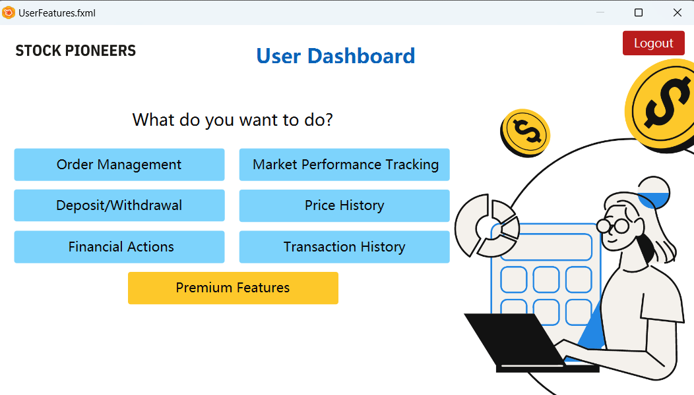

## Key PremiumUser Features and Methods

The `PremiumUser` class extends the `RegularUser` class and implements the `Observer` interface. This class provides additional functionalities for premium users in a stock trading system.


### Key Methods

#### `update(User user)`
This method is called when there is an update to a user's information. It prints a message indicating the user being updated.

```java
@Override
    public void update(User user) {
        System.out.println("Updating user: " + user.getUserName());
    }
```

#### `subscribeForNotifications()`
This method allows the premium user to subscribe to notifications for stock price changes. It subscribes the user to the `MarketPerformanceTracker` and prints a confirmation message.

```java
public void subscribeForNotifications() {
    MarketPerformanceTracker.subscribe(this);
    System.out.println("Subscribed for notifications on stock price changes.");
}
```
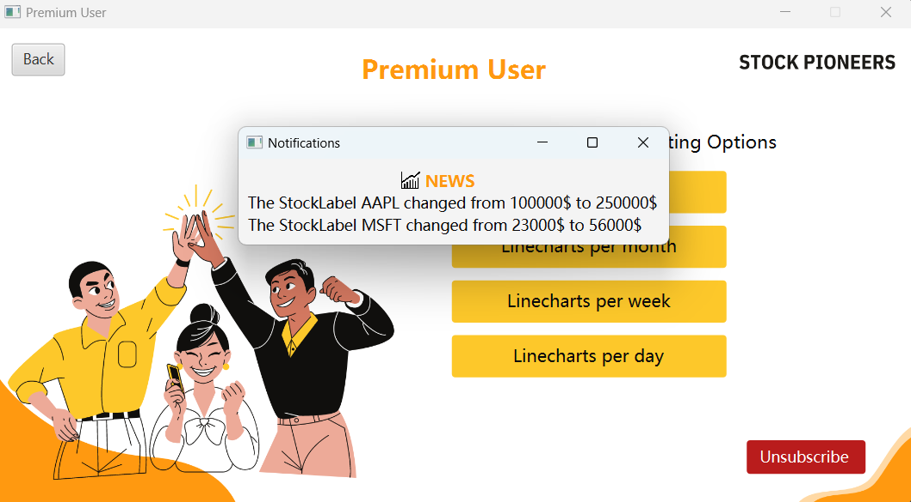

#### `unsubscribeFromNotifications()`
This method allows the premium user to unsubscribe from notifications for stock price changes. It unsubscribes the user from the `MarketPerformanceTracker` and prints a confirmation message.

```java
public void unsubscribeFromNotifications() {
    MarketPerformanceTracker.unsubscribe(this);
    System.out.println("Unsubscribed from notifications on stock price changes.");
}
```

#### `showLineChart(String stockLabel, Map<String, List<StockPrice>> stockPrices)`
This method displays a simple line chart for a specific stock. It retrieves the price history for the given stock label and prints the price data in a line chart format.

```java
public void showLineChart(String stockLabel, Map<String, List<StockPrice>> stockPrices) {
    List<StockPrice> priceHistory = stockPrices.get(stockLabel);
    if (priceHistory == null || priceHistory.isEmpty()) {
        System.out.println("No price history found for stock with label: " + stockLabel);
        return;
    }

    // Display line chart for the specified stock
    System.out.println("Line chart for stock with label: " + stockLabel);
    for (StockPrice price : priceHistory) {
        // Draw a simple line chart representation
        System.out.println(price.getDateTime() + " - " + price.getTradingPrice());
    }
}
```
<table style="width:100%;">
  <tr>
    <td style="text-align:center;">
      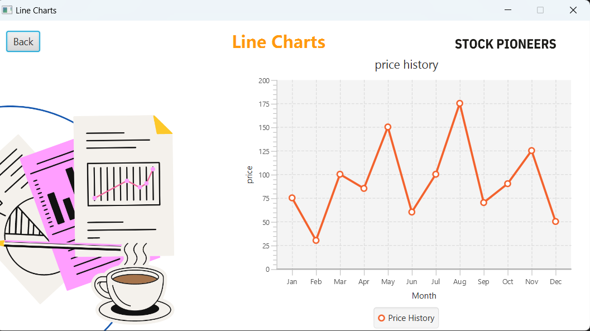
    </td>
    <td style="text-align:center;">
      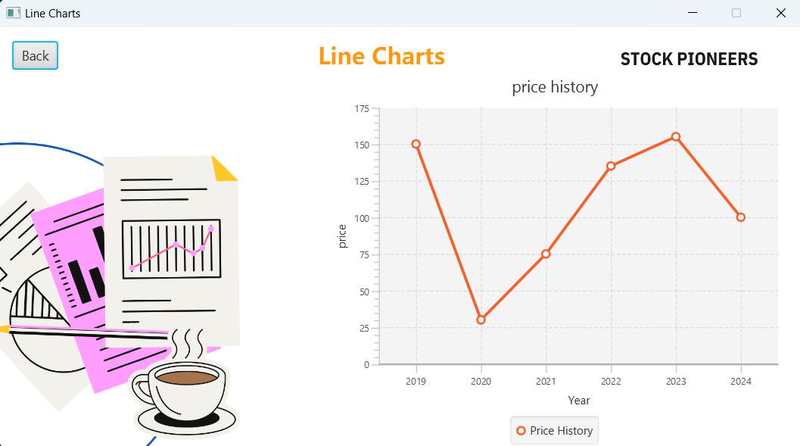
    </td>
  </tr>
</table>

The `PremiumUser` class enhances the functionalities provided to regular users by including the ability to subscribe and unsubscribe from stock price change notifications and view line charts for specific stocks. These features are designed to give premium users more control and information in their trading activities.


## UML Diagram 

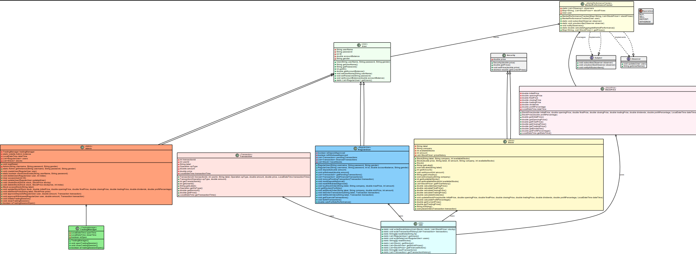


## Sequence Diagram

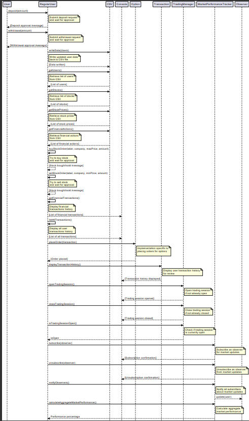

## Contributors  

- [Raghad Abdelhameed](https://github.com/RaghadAbdelhameed) UI Design and Writing README
- [Zeyad Ashraf Nassar](https://github.com/ZEY0D) Backend , Testing and Debbuging
-  [Rawan Mohammed](https://github.com/rawan-mohamed-n) Merging Backend to Frontend and making some modifications to UI Design
- [Ahmed Loay](https://github.com/Ahmedloay2) Merging CSV File to Bakend and Tables
- [Mostafa Ashraf](https://github.com/Nagafa007) Tables and helping in CSV

## Thankyou for using our STOCKPIONEERS APPLICATION!!

