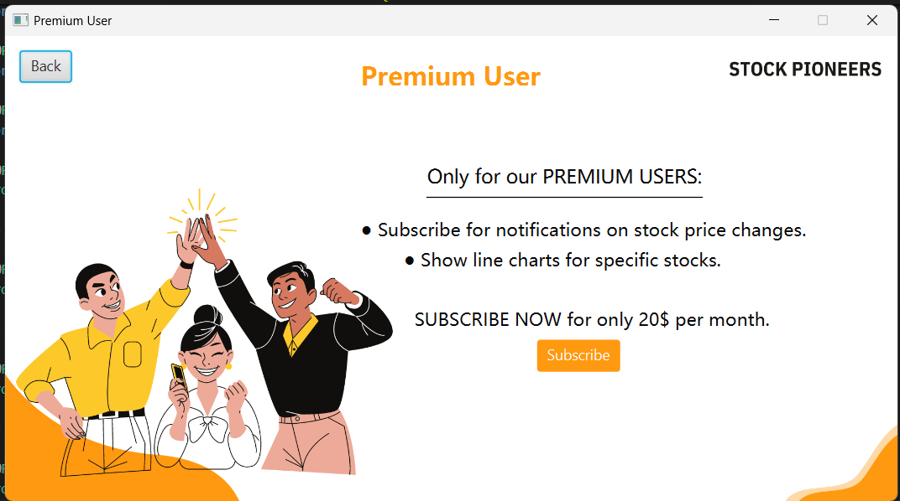
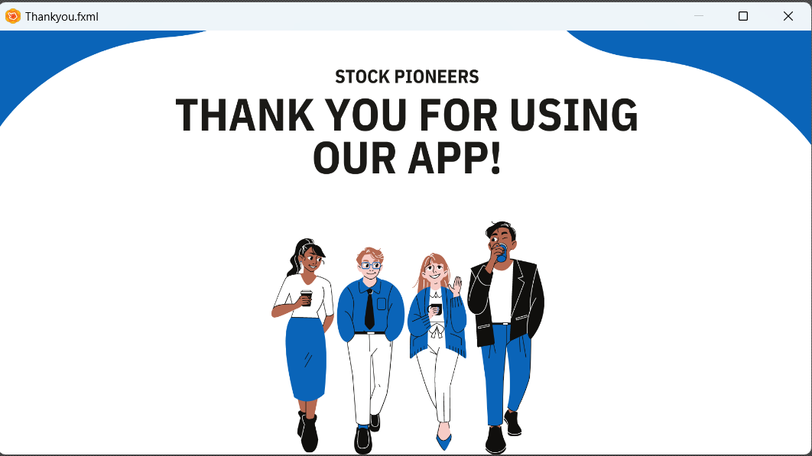

# StockPioneers Application

## Introduction

Welcome to **StockPioneers**—your favorite Stock Exchange Manager Desktop Application! This application is designed and implemented using Java, with a strong emphasis on applying Object-Oriented Programming (OOP) principles. We used JavaFX for the user interface. This system serves as a simulated stock exchange platform where traders can buy and sell stocks, manage their portfolios, and analyze market data.

This project provides a robust learning experience in Java programming and OOP principles, offering a realistic simulation of stock exchange operations. We look forward to your innovative solutions and collaborative efforts in bringing this Stock Exchange Manager to life.

## Technology Used

StockPioneers uses JavaFX for its Graphical User Interface (GUI). JavaFX provides a rich set of graphics and media packages to create modern, visually appealing user interfaces, enhancing the user experience by making the application more interactive and user-friendly.

## Installation 

Clone our repository and import the JavaFX library.

The workspace contains folders as shown:
- `src`: folder for source files
- `lib`: folder for dependencies
- `csv files`: folder for data
- `data`: folder for images 

> Remember to configure the JavaFX library path in `.vscode/launch.json`.

## Login UI
<table style="width:100%;">
  <tr>
    <td style="text-align:center;">
      
    </td>
    <td style="text-align:center;">
      
    </td>
  </tr>
</table>

## Key Admin Features and Methods

The `Admin` class in the Stock Exchange Manager is designed to handle critical administrative tasks, ensuring smooth operation and management of the stock exchange platform. Below are some key features provided for the admin:

### 1. User Management

- **Create User**
  - Allows the admin to add new users to the system.
  

- **Delete User**
  - Enables the admin to remove existing users from the platform.

- **Update User**
  - Allows modifications to user information.

- **Access User**
  - Enables viewing specific user details.
  
  <table style="width:100%;">
  <tr>
    <td style="text-align:center;">
      
    </td>
    <td style="text-align:center;">
      
    </td>
  </tr>
</table>

### 2. Stock Management

- **Create Stock**
  - Allows the admin to add new stocks to the platform.

- **Delete Stock**
  - Enables the removal of stocks from the platform.

- **Update Stock**
  - Allows for updating stock information and prices.

- **Access Stock**
  - Provides details for a specific stock.
  

### 3. Stock Price Management

- **Add Stock Price**
  - Enables the addition of price data for stocks.

- **Display Price History**
  - Shows historical price data for selected stocks.
  

### 4. Approval System

- **Approve Deposit**
  - Allows the admin to approve deposit requests from users.

- **Approve Withdrawal**
  - Enables the admin to approve user withdrawal requests.

### 5. Trading Session Management

- **Initiate Trading Session**
  - Starts a new trading session.

- **Close Trading Session**
  - Ends the current trading session.

- **Check if Trading Session is Open**
  - Verifies if a trading session is currently active.
  

These features enable the admin to manage users, stocks, stock prices, and trading sessions efficiently, ensuring a robust and reliable stock exchange system.

## Key RegularUser Features and Methods

The `RegularUser` class extends from the `User` class, adding functionalities specific to regular users of the stock exchange platform. Here are the essential features for the `RegularUser` class:

### 1. Financial Transactions

- **Deposit Funds (Pending Admin Approval)**
  - Allows users to submit a deposit request.

- **Withdraw Funds (Pending Admin Approval)**
  - Allows users to submit a withdrawal request.

- **Get Pending Transactions**
  - Lists all pending transactions.
  

### 2. Stock Orders

- **Buy Stock Order**
  - Allows the user to place a buy order for stocks.

- **Sell Stock Order**
  - Enables the user to place a sell order.

### 3. Transaction History

- **List All Transactions**
  - Displays all financial and order transactions made by the user.

### 4. Portfolio Performance

- **Calculate Portfolio Performance**
  - Evaluates the performance of the user’s portfolio based on profit/loss.

These features enable the regular user to manage financial transactions, buy and sell stocks, track transaction history, and evaluate portfolio performance efficiently.

## Key PremiumUser Features and Methods

The `PremiumUser` class extends the `RegularUser` class, adding extra functionalities for premium users in a stock trading system.

### Key Features

- **Subscribe for Notifications**
  - Allows premium users to subscribe to stock price change notifications.
  

- **Unsubscribe from Notifications**
  - Allows users to opt out of stock price notifications.

- **Show Line Chart**
  - Displays a line chart showing the price history for specific stocks.
  
<table style="width:100%;">
  <tr>
    <td style="text-align:center;">
      
    </td>
    <td style="text-align:center;">
      
    </td>
  </tr>
</table>

The `PremiumUser` class enhances the functionalities available to regular users, giving premium users more control and information in their trading activities.

## UML Diagram 

## Sequence Diagram

## Contributors  

- [Raghad Abdelhameed](https://github.com/RaghadAbdelhameed) - UI Design and Writing README
- [Zeyad Ashraf Nassar](https://github.com/ZEY0D) - Backend, Testing, and Debugging
- [Rawan Mohammed](https://github.com/rawan-mohamed-n) - Merging Backend to Frontend and UI Modifications
- [Ahmed Loay](https://github.com/Ahmedloay2) - Integrating CSV Files with Backend and Tables
- [Mostafa Ashraf](https://github.com/Nagafa007) - Tables and CSV Integration

---

Thank you for using **STOCKPIONEERS APPLICATION**!

---
